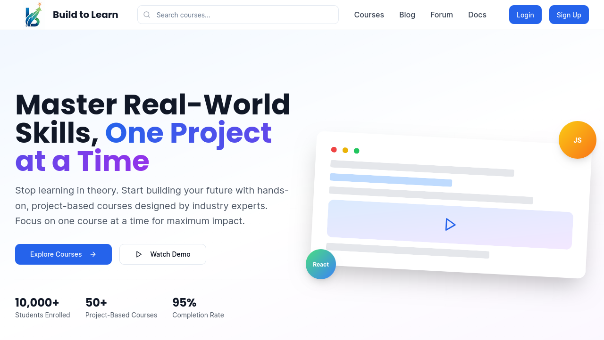

# 🧱 Build to Learn

A modern, adaptive, and project-based learning platform designed for developers. Built using a MVC architecture with NestJS.

<!--  -->

<!-- > 🚀 Live: [https://build-to-learn-web.vercel.app](https://build-to-learn-web.vercel.app) -->

## Folder Structure

```txt
client/
server/
```

## 🛠️ Tech Stack

- 🧠 **Next.js 15** (App Router)
- ⚙️ **Nest.js** (Backend API)
- 🖌️ **Tailwind CSS + ShadCN UI**
- 🗃️ **PostgreSQL (NEON)** (via Drizzle)
- 🧪 **Jest + Supertest** (Testing)
- 🐳 **Docker** (for DB & CI/CD)
- ☁️ **GitHub Actions** (CI)
- 🌐 **Vercel** (Deployment)

## 🚀 Getting Started

> Ensure you have [PNPM](https://pnpm.io), [Node.js (>=22.x)](https://nodejs.org/en), and [Docker](https://www.docker.com/) installed.

### 1. Clone the repository

```bash
git clone https://github.com/maruf-pfc/build-to-learn.git
cd build-to-learn
```

## 📁 Useful Scripts

```bash
pnpm dev                # Start all apps for development
pnpm build              # Build all apps
pnpm lint               # Run ESLint across all packages
pnpm format             # Run Prettier
pnpm test               # Run all tests (API)
```

## 🤝 Contributing

We welcome contributions! Feel free to:

- Open issues
- Suggest features
- Submit pull requests

## 📄 License

Apache License
