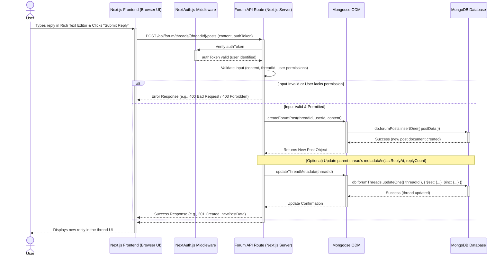

# High-Level & Low-Level Design

## 1. High-Level System Architecture Diagram

This diagram illustrates the main components of the "Build to Learn" platform and how they interact at a macroscopic level. It shows the overall structure, key services, and how different parts of your application connect.

**Description:**

The user (whether a Student, Instructor, Moderator, or Admin) interacts with the platform through a **Client (Web Browser)**, which runs the **Next.js Frontend**. This frontend is responsible for rendering the user interface and handling user interactions.

The entire application is conceptualized as being hosted (e.g., on Vercel or another cloud provider). The core of the backend is the **Next.js Server**, which not only serves the frontend pages (via Server-Side Rendering or Static Site Generation) but also handles **API Routes** for all backend logic.

Within this Next.js Server:

- **Core Application Logic** encompasses the main API endpoints and business rules.
- This core logic manages several **Feature Modules**, which represent the distinct functionalities of your platform: Course Management, the Forum System, the Blog System, User & Role Management, Project Submissions, and the MCQ & Assessment module.
- The server interacts with several key services:
  - **Authentication Service (NextAuth.js):** Manages user login, sessions, and role verification.
  - **Database (MongoDB):** The persistent storage for all platform data. The diagram breaks this down into the main collections you'll have, such as `Users`, `Courses`, `ForumThreads`, `BlogPosts`, etc.
  - **File Storage (Cloudinary/S3):** Used for storing uploaded files like project submissions, images for blog posts, or attachments in the forum.
  - **PDF Generation Service:** Responsible for creating PDF certificates upon course completion.

```mermaid
graph TD
    A[User: Student, Instructor, Moderator, Admin] --> B{Client: Web Browser - Next.js Frontend};

    subgraph "Build to Learn Platform Infrastructure (e.g. Hosted on Vercel/Cloud)"
        direction LR
        B --> C{Next.js Server: SSR/SSG, API Routes};

        subgraph "Backend Services & Logic (within Next.js Server)"
            C_Core[API Endpoints & Business Logic]

            subgraph "Feature Modules (Managed by Core Logic)"
                direction TB
                C_Users[User & Role Mgmt Module]
                C_Courses[Course Mgmt Module]
                C_Projects[Project Submission Module]
                C_MCQ[MCQ & Assessment Module]
                C_Forums[Forum System Module]
                C_Blogs[Blog System Module]
            end

            C --> C_Core;
            C_Core --> C_Users;
            C_Core --> C_Courses;
            C_Core --> C_Projects;
            C_Core --> C_MCQ;
            C_Core --> C_Forums;
            C_Core --> C_Blogs;
        end

        C --> D[Authentication Service: e.g. NextAuth.js];
        C --> E[Database: MongoDB];
        C --> F[File Storage: e.g. Cloudinary/S3];
        C --> G[PDF Generation Service];

        subgraph "MongoDB Collections"
            direction TB
            E_Users[Users, Roles, Subscriptions]
            E_Courses[Courses, Modules, Parts]
            E_Enrollments[Enrollments, Progress]
            E_Submissions[Project Submissions, Feedback]
            E_MCQResults[MCQ Results, Cheat Flags]
            E_ForumCats[Forum Categories]
            E_ForumThreads[Forum Threads]
            E_ForumPosts[Forum Posts]
            E_BlogCats[Blog Categories]
            E_BlogPosts[Blog Posts]
            E_BlogComments[Blog Comments]
        end
        E -.-> E_Users;
        E -.-> E_Courses;
        E -.-> E_Enrollments;
        E -.-> E_Submissions;
        E -.-> E_MCQResults;
        E -.-> E_ForumCats;
        E -.-> E_ForumThreads;
        E -.-> E_ForumPosts;
        E -.-> E_BlogCats;
        E -.-> E_BlogPosts;
        E -.-> E_BlogComments;

    end

    style A fill:#f9f,stroke:#333,stroke-width:2px
    style B fill:#lightgrey,stroke:#333,stroke-width:2px
    style C fill:#lightblue,stroke:#333,stroke-width:2px
    style D fill:#lightgreen,stroke:#333,stroke-width:2px
    style E fill:#orange,stroke:#333,stroke-width:2px
    style F fill:#lightyellow,stroke:#333,stroke-width:2px
    style G fill:#pink,stroke:#333,stroke-width:2px
    style C_Core fill:#add8e6,stroke:#333,stroke-width:1px
    style C_Users fill:#dae8fc,stroke:#333,stroke-width:1px
    style C_Courses fill:#dae8fc,stroke:#333,stroke-width:1px
    style C_Projects fill:#dae8fc,stroke:#333,stroke-width:1px
    style C_MCQ fill:#dae8fc,stroke:#333,stroke-width:1px
    style C_Forums fill:#dae8fc,stroke:#333,stroke-width:1px
    style C_Blogs fill:#dae8fc,stroke:#333,stroke-width:1px
```

## 2. Low-Level Diagram (Sequence Diagram)

This diagram provides a more detailed, step-by-step view of a specific interaction within the system. We'll illustrate the sequence of events when a **User posts a reply on the forum**.

**Description:**

This sequence diagram shows the chronological flow of messages between different components involved in posting a forum reply:

1.  The **User** types their reply in the Rich Text Editor on the **Next.js Frontend** (running in their browser) and clicks the "Submit Reply" button.
2.  The **Frontend** sends an HTTP POST request to the appropriate **Forum API Route** (e.g., `/api/forum/threads/{threadId}/posts`). This request includes the content of the reply and the user's authentication token.
3.  The **NextAuth.js Middleware** (or a similar authentication check integrated into the API route) intercepts the request to verify the `authToken`.
4.  If the token is valid, the middleware confirms the user's identity and allows the request to proceed to the **Forum API Route** handler.
5.  The API route handler first **validates the input** (e.g., checking if the content is not empty, if the `threadId` is valid).
6.  If the input is invalid, an error response is sent back to the Frontend.
7.  If the input is valid, the API handler uses the **Mongoose ODM** (Object Data Mapper) to create a new forum post document.
8.  **Mongoose** translates this operation into a command for the **MongoDB** database (e.g., an `insertOne` operation on the `forumPosts` collection).
9.  **MongoDB** executes the command and, upon success, confirms the creation of the new post document back to Mongoose.
10. **Mongoose** returns the newly created post object (or a success confirmation) to the API handler.
11. The API handler might then perform **optional follow-up actions**, such as updating the parent forum thread's metadata (e.g., `lastReplyAt` timestamp, `replyCount`). This would involve another interaction with Mongoose and MongoDB.
12. Finally, the **Forum API Route** sends a success response (e.g., HTTP 201 Created, along with the data of the newly created post) back to the **Frontend**.
13. The **Frontend** then updates the user interface to display the new reply in the forum thread, providing immediate feedback to the **User**.

