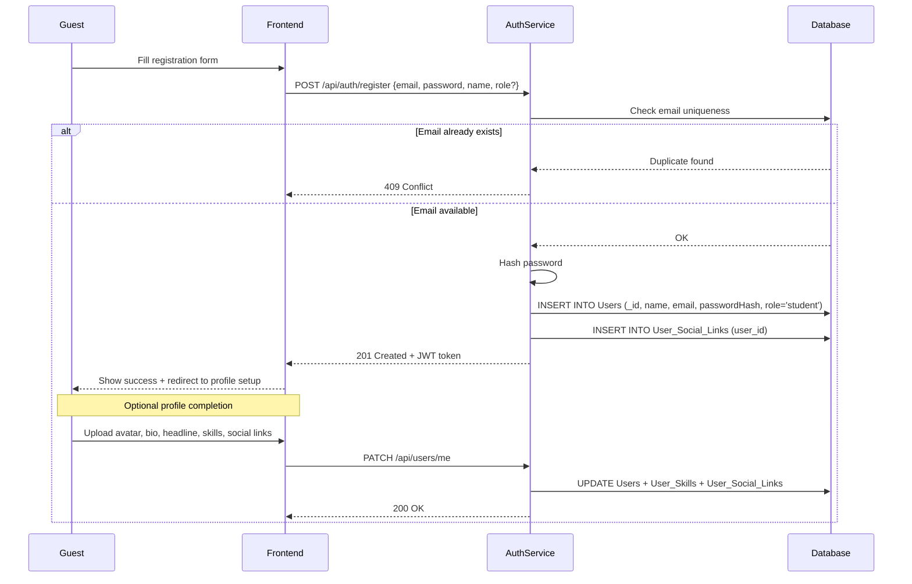
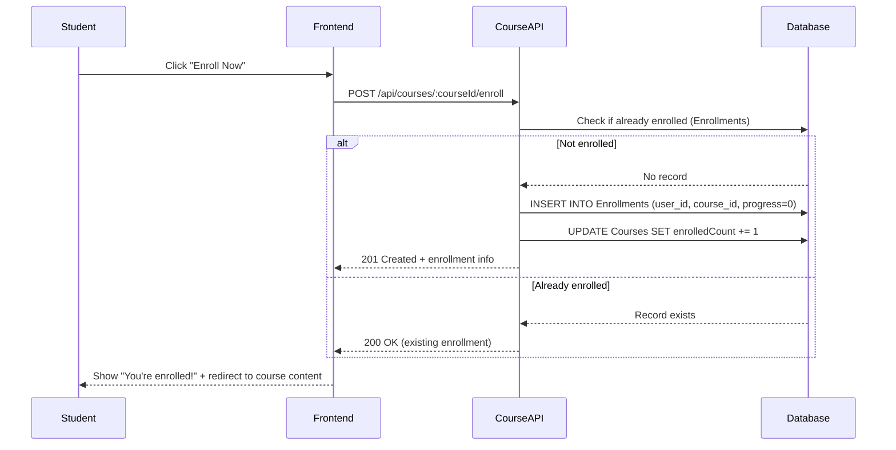
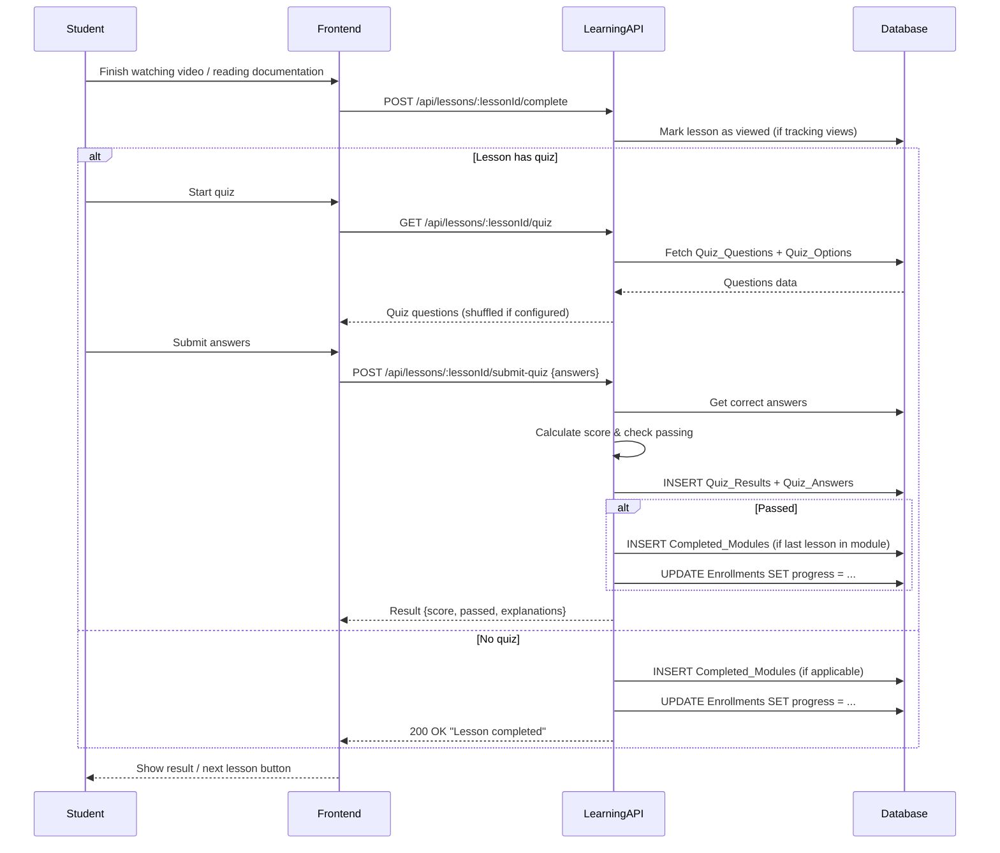
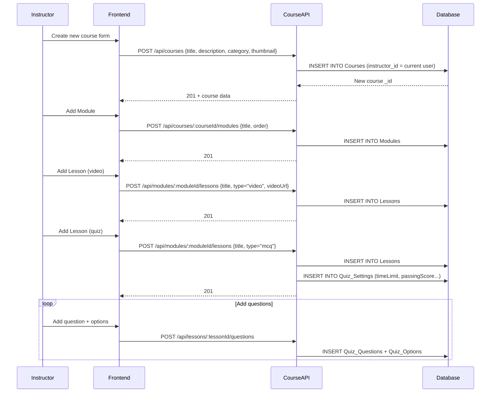
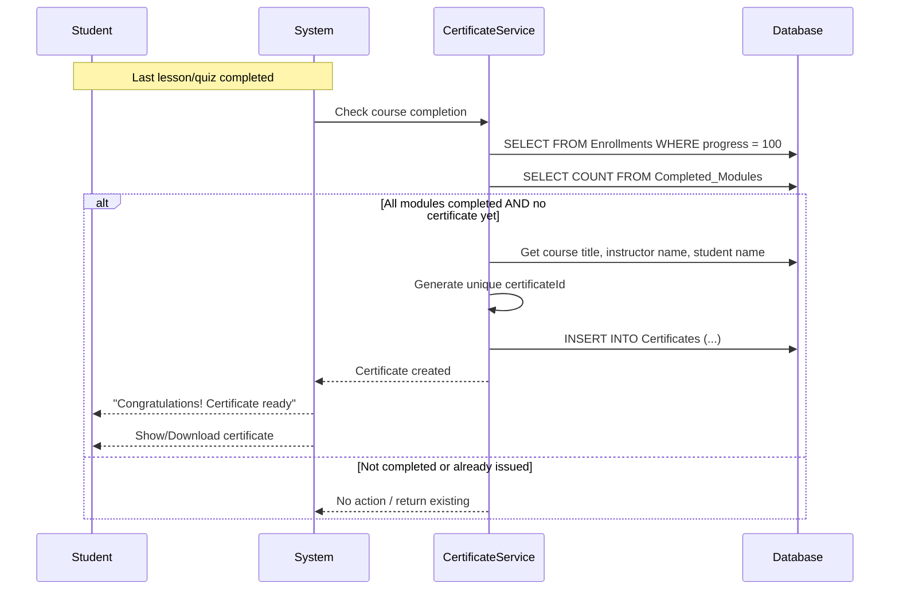
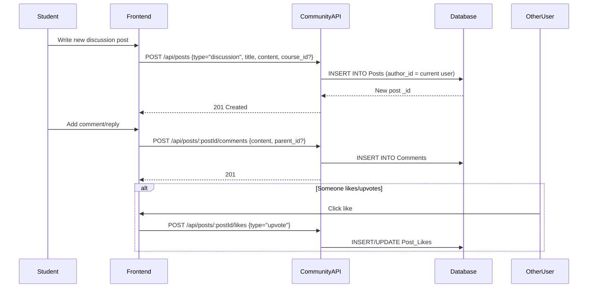
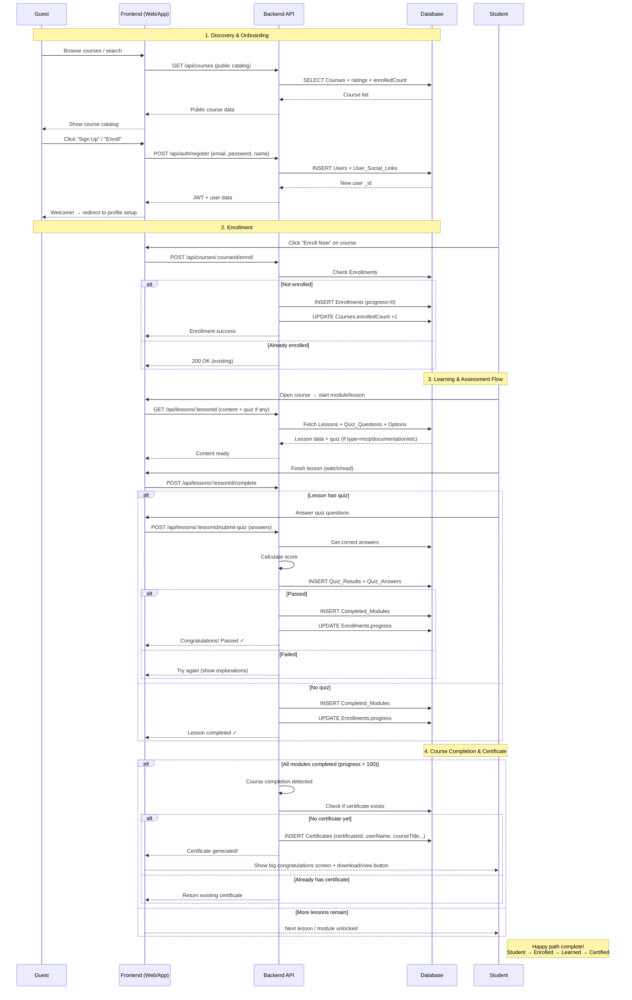

# Sequence Diagrams

## Here are the **most important sequence diagrams** for a modern online learning platform.

### 1. User Registration + Profile Completion

### 2. Student Enrolls in a Course

### 3. Student Completes a Lesson + Quiz (Most Important Student Flow)

### 4. Instructor Creates Course + Content Structure

### 5. Certificate Issuance (Course Completion)

### 6. Forum Post + Comment Thread (Community Feature)

These six diagrams cover the **core flows** that appear most frequently in real online learning platforms:

1. Registration & onboarding  
2. Course enrollment  
3. Learning + assessment flow (most important student journey)  
4. Course/content creation (instructor)  
5. Certificate generation  
6. Community interaction

Here is a **single, combined Mermaid sequence diagram** that shows the **main happy-path flow** of a typical student journey in your online learning platform — from browsing → registration → enrollment → learning → quiz → completion → certificate.

This is the "all-in-one" version most people find useful for quick overview / presentation / documentation:

### Quick Summary of the Flow (text version)

1. Guest browses public catalog  
2. Registers → becomes Student  
3. Enrolls in course  
4. Goes through lessons (content + optional quizzes)  
5. Submits quizzes → gets immediate feedback  
6. Completes all modules → progress reaches 100%  
7. Automatically receives certificate

This single diagram is commonly used in:

- Project documentation
- Pitch decks
- Team handovers
- Architecture overviews
